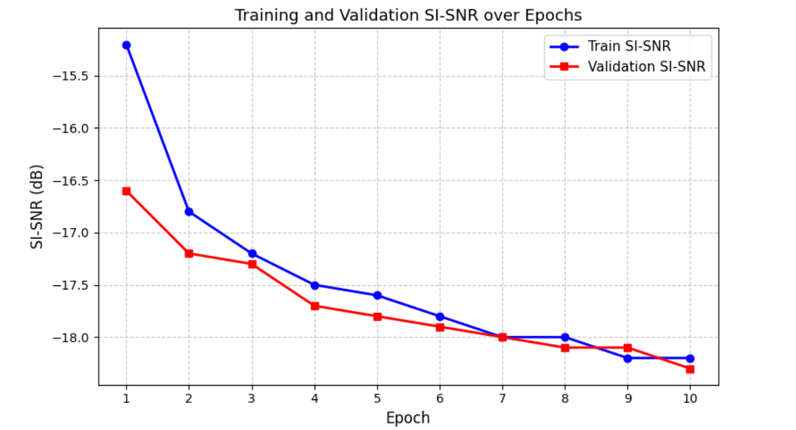
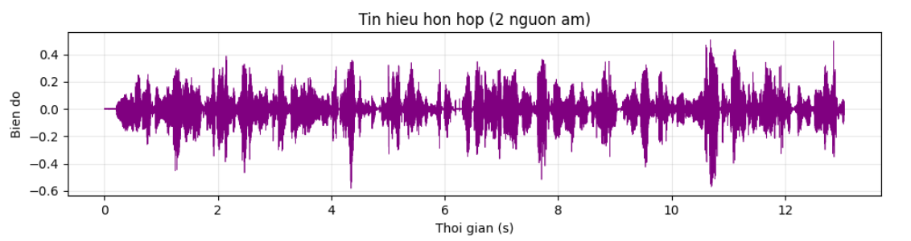
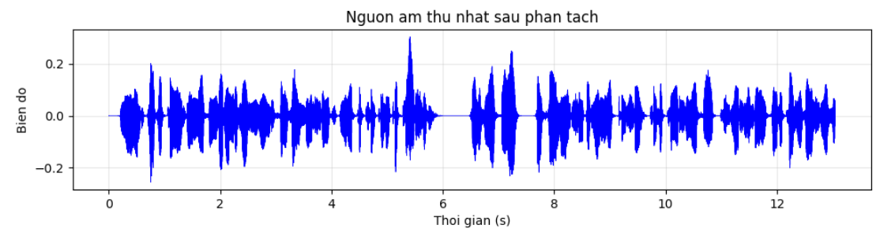
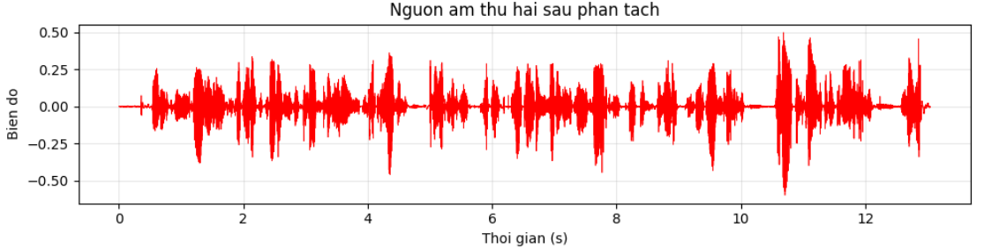

# 🎙️ SepFormer — Phân tách nguồn âm thanh đơn kênh

[](https://python.org)
[](https://pytorch.org)
[](https://huggingface.co/spaces/quockhanh25032005/sepformer-demo)
[](LICENSE)

> Triển khai kiến trúc **SepFormer (Separation Transformer)** cho bài toán phân tách nguồn âm thanh đơn kênh — tách biệt giọng nói của từng người từ một file âm thanh hỗn hợp chứa nhiều người nói cùng lúc.

---

## 🎯 Demo trực tuyến

👉 **[Thử ngay tại đây](https://huggingface.co/spaces/quockhanh25032005/sepformer-demo)**

Upload file âm thanh chứa 2 người nói → Model tự động tách thành 2 nguồn âm riêng biệt.
(có thể lấy file mix sẵn được chuẩn bị ở mục examples để demo)

---

## 📖 Giới thiệu

### Bài toán

Bài toán **phân tách nguồn âm** (Speech Separation) hay còn gọi là **Cocktail Party Problem** — khả năng tập trung vào một nguồn âm duy nhất trong môi trường có nhiều người nói và tạp âm đan xen.

Về mặt toán học, bài toán được phát biểu như sau: Giả sử có N nguồn âm độc lập s₁(t), s₂(t), ..., sₙ(t), tín hiệu thu được tại micro là hỗn hợp tuyến tính:

```
x(t) = s₁(t) + s₂(t) + ... + sₙ(t)
```

Mục tiêu là ước lượng lại từng ŝᵢ(t) sao cho ŝᵢ(t) ≈ sᵢ(t), chỉ từ tín hiệu quan sát x(t).

### Tại sao SepFormer?

Các phương pháp truyền thống (ICA, NMF) gặp nhiều hạn chế khi áp dụng vào bài toán thực tế. Sự ra đời của học sâu đã mang lại bước ngoặt lớn — đặc biệt là **SepFormer** (2021), kiến trúc đầu tiên thay thế hoàn toàn RNN bằng Transformer trong bài toán phân tách nguồn âm, đạt kết quả vượt trội so với tất cả các phương pháp trước đó.

### Ứng dụng thực tiễn

- 🎤 **Nhận dạng giọng nói (ASR)** — Cải thiện độ chính xác trong môi trường ồn ào
- 🤖 **Trợ lý ảo** — Siri, Google Assistant, Alexa
- 📹 **Hội nghị truyền hình** — Tách biệt giọng từng người tham gia
- 👂 **Máy trợ thính** — Lọc bỏ tạp âm, khuếch đại giọng mục tiêu
- 🔍 **Phân tích pháp y âm thanh** — Phục hồi giọng nói từ bản ghi âm chất lượng thấp

---

## 🏗️ Kiến trúc

```
Tín hiệu hỗn hợp x(t)
        │
        ▼
┌─────────────┐
│   Encoder   │  ← 1D Conv học được (thay thế STFT)
└─────────────┘
        │
        ▼
┌──────────────────────────────────────┐
│          SepFormer Block             │
│  ┌────────────────────────────────┐  │
│  │      IntraTransformer          │  │  ← Học phụ thuộc cục bộ
│  └────────────────────────────────┘  │
│  ┌────────────────────────────────┐  │
│  │      InterTransformer          │  │  ← Học phụ thuộc toàn cục
│  └────────────────────────────────┘  │
│         × R lần (R=2)                │
└──────────────────────────────────────┘
        │
        ▼
┌─────────────┐
│  Mask Net   │  ← PReLU + Linear + ReLU → M₁, M₂
└─────────────┘
        │
        ▼
┌─────────────┐
│   Decoder   │  ← 1D ConvTranspose tái tạo tín hiệu
└─────────────┘
        │
        ▼
  ŝ₁(t),  ŝ₂(t)
```

---

## 📊 Kết quả thực nghiệm

### Cấu hình huấn luyện

| Siêu tham số | Giá trị |
|---|---|
| Số epoch | 10 |
| Batch size | 1 |
| Learning rate | 1.5×10⁻⁴ |
| Optimizer | Adam |
| Độ dài tín hiệu tối đa | 32.000 mẫu (4 giây) |
| Hàm mất mát | SI-SNR + PIT |
| GPU | NVIDIA Tesla T4 × 2 |

### Loss Curve



> SI-SNR giảm đều đặn qua các epoch, tốc độ cải thiện chậm dần từ epoch 7 cho thấy mô hình đang hội tụ. Khoảng cách nhỏ giữa train và valid SI-SNR cho thấy không có hiện tượng overfitting.

### Kết quả đánh giá

Mô hình được đánh giá trên 100 mẫu từ tập validation của Libri2Mix và đạt **SI-SNRi = 21.60 dB** — cho thấy tín hiệu sau phân tách có chất lượng cao hơn tín hiệu hỗn hợp đầu vào 21.60 dB, tương đương với mức cải thiện rõ rệt mà người nghe có thể cảm nhận được trực tiếp.

### Kết quả phân tách tín hiệu

**Tín hiệu hỗn hợp (đầu vào):**



**Nguồn âm thứ nhất sau phân tách:**



**Nguồn âm thứ hai sau phân tách:**



---

## 📁 Cấu trúc thư mục

```
sepformer-speech-separation/
│
├── model/
│   ├── encoder.py          # Learned Encoder (1D Conv)
│   ├── decoder.py          # Learned Decoder (1D ConvTranspose)
│   ├── sepformer_block.py  # Dual-Path Transformer Block
│   └── sepformer.py        # Kiến trúc SepFormer hoàn chỉnh
│
├── utils/
│   ├── dataset.py          # Libri2Mix Dataset loader
│   └── metrics.py          # SI-SNR, SI-SNRi, PIT
│
├── assets/                 # Hình ảnh kết quả
├── train.py                # Script huấn luyện
├── evaluate.py             # Script đánh giá
├── app.py                  # Web demo (Gradio)
└── requirements.txt        # Thư viện cần thiết
```

---

## ⚙️ Cài đặt

```bash
git clone https://github.com/qockhah253/sepformer-speech-separation
cd sepformer-speech-separation
pip install -r requirements.txt
```

---

## 🚀 Sử dụng

### Huấn luyện

```bash
python train.py
```

### Đánh giá

```bash
python evaluate.py
```

### Sử dụng model trong code

```python
import torch
from model.sepformer import SepFormer

model = SepFormer(num_filters=256, filter_length=16, stride=8,
                  d_model=256, nhead=8, num_spks=2)

checkpoint = torch.load("checkpoints/checkpoint_epoch_10.pt")
model.load_state_dict(checkpoint['model_state_dict'])
model.eval()

with torch.no_grad():
    mixture = torch.randn(1, 32000)
    sources = model(mixture)       # (batch, 2, T)
    source1 = sources[0, 0, :]
    source2 = sources[0, 1, :]
```

---

## 🛠️ Công nghệ sử dụng

| Công nghệ | Mục đích |
|-----------|---------|
| PyTorch | Framework học sâu |
| SpeechBrain | Công cụ xử lý tiếng nói |
| Librosa | Xử lý tín hiệu âm thanh |
| Gradio | Giao diện web demo |
| Kaggle (GPU T4 x2) | Môi trường huấn luyện |

---

## 📚 Tài liệu tham khảo

1. **Subakan et al. (2021)** — [Attention is All You Need in Speech Separation](https://arxiv.org/abs/2010.13154)
2. **Luo & Mesgarani (2019)** — [Conv-TasNet](https://arxiv.org/abs/1809.07454)
3. **Luo et al. (2020)** — [Dual-Path RNN](https://arxiv.org/abs/1910.06379)
4. **Vaswani et al. (2017)** — [Attention is All You Need](https://arxiv.org/abs/1706.03762)
5. **Cosentino et al. (2020)** — [LibriMix](https://arxiv.org/abs/2005.11262)

---

## 👨‍💻 Tác giả

| | |
|---|---|
| **Sinh viên** | Triệu Quốc Khánh |
| **Giảng viên hướng dẫn** | CN. Vi Anh Quân |
| **Trường** | Đại học Khoa học Tự nhiên — ĐHQGHN |
| **Khoa** | Vật lý — Bộ môn Tin học Vật lý |
| **Năm** | 2024 |

---

<div align="center">
  <i>Nếu thấy hữu ích, hãy ⭐ star repo này!</i>
</div>
